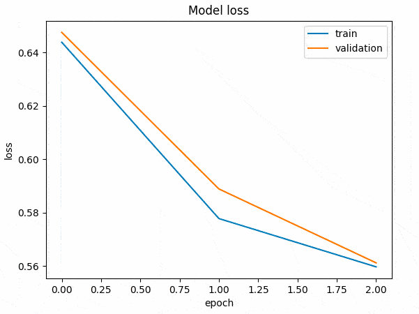
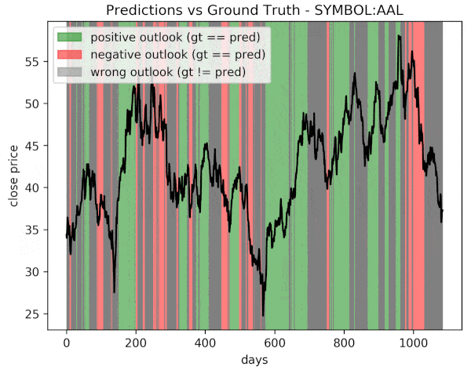

# sp500-forecaster
* __task:__ predict if the next 30 days mean close price will be higher/lower than the past 30 days mean close price
* __input:__ past 144 days ohlcv data

## Create+train+evaluate+save forecaster
```console
usage: create.py [-h] [-o OUTPUT] [-v] [-d] stocknum epochs

Create a model to predict future stock trends of SP500 companies.

positional arguments:
  stocknum              number of sp500 stocks to retrieve (0=all)
  epochs                number of training epochs

optional arguments:
  -h, --help            show this help message and exit
  -o OUTPUT,            path to output directory (default ./out)
  -v, --verbose         verbose output, default true
  -d, --debug           visual train info, default false
```

## Load h5 model weights and predict future prices
```console
usage: predict.py [-h] [-o OUTPUT] [-v] weights symbols [symbols ...]

Predict future stock trends using a pretrained forecaster.

positional arguments:
  weights               path to h5 forecaster weights
  symbols               list of 1 or more iex-supported tickers

optional arguments:
  -h, --help            show this help message and exit
  -o OUTPUT, --output OUTPUT
                        path to output directory (default ./out)
  -v, --verbose         verbose output, default true

```

## create.py visual overview
1. gather S&P500 OHLCV data and split into train/test
```console
sp500forecaster [DEBUG]: collected 404 train, 101 test sp500 stocks
sp500forecaster [DEBUG]: building train time windows
```

2. transform normalized OHLCV train data into time windows


3. train forecaster


4. evaluate on test time windows


## predict.py
```console
python predict.py out/n25_acc0.72_20180916225602.h5 AAPL MMM
Using TensorFlow backend.
sp500forecaster [DEBUG]: symbols: ['AAPL', 'MMM']
sp500forecaster [DEBUG]: processing AAPL
sp500forecaster [DEBUG]: positive future prediction for symbol AAPL
sp500forecaster [DEBUG]: processing MMM
sp500forecaster [DEBUG]: positive future prediction for symbol MMM
```

## Requirements
```console
az@ubuntu:~/sp500-forecaster$ cat /etc/issue*
Ubuntu 16.04.4 LTS
az@ubuntu:~/sp500-forecaster$ python --version
Python 2.7.12
az@ubuntu:~/sp500-forecaster$ pip install -r stock2image/requirements.txt
...
```
